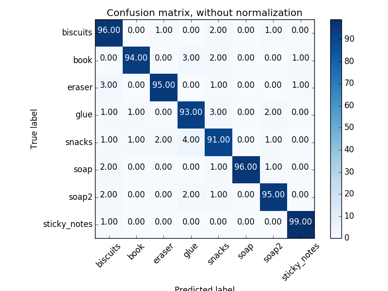
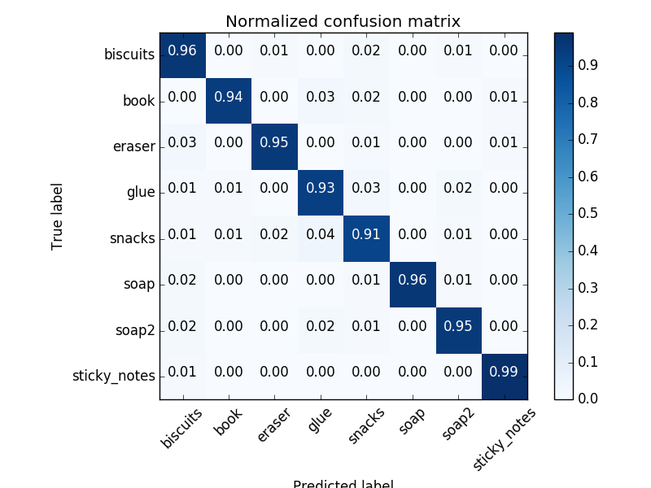

# Project: Perception Pick & Place

[//]: # (Image References)

[image1]: ./misc/figure_1.png
[image2]: ./misc/figure_2.png
[image3]: ./misc/world1.png
[image4]: ./misc/world2.png
[image5]: ./misc/world3.png

## Object Recognition Pipeline

First we extract features from all 8 objects using color and surface normal features. The feature extraction was in the HSV color space for 100 different pose orientations for each object. SVM training for object recognition with linear kernel was utilized. The confusion matrix reveals adequate recognition results.


  

Next, and for each world, the following pipeline was used highlighting some important code parts. Note that the same parameters of the code are used for all the three worlds.

A Statistical Outlier Filtering is first applied to the point cloud of the RGB-D camera.
```
outlier_filter = pcl_datacloud.make_statistical_outlier_filter()
outlier_filter.set_mean_k(50)
x = 1.0
outlier_filter.set_std_dev_mul_thresh(x)
cloud_filtered = outlier_filter.filter() 
```
Afterwards, a Voxel Grid Downsampling and a PassThrough Filter are applied to work with less data points for time efficiency. I applied two axis filtering for elimination the box outliers
```
vox = cloud_filtered.make_voxel_grid_filter()
LEAF_SIZE = 0.003
vox.set_leaf_size(LEAF_SIZE, LEAF_SIZE, LEAF_SIZE)
cloud_filtered = vox.filter()
passthrough = cloud_filtered.make_passthrough_filter()
filter_axis = 'z'
passthrough.set_filter_field_name(filter_axis)
axis_min = 0.6
axis_max = 1.1
passthrough.set_filter_limits(axis_min, axis_max)
cloud_filtered = passthrough.filter()
passthrough = cloud_filtered.make_passthrough_filter()  # second filter for passing out drop boxes
filter_axis = 'x'
passthrough.set_filter_field_name(filter_axis)
axis_min = 0.3
axis_max = 1.0
passthrough.set_filter_limits(axis_min, axis_max)
cloud_filtered = passthrough.filter()
```

## Results

For each world, a yaml file is extracted containing all the necessary details for the pick and place routine.

#### World 1 

Yaml File: [output_1.yaml](https://github.com/aaman-ee/RoboND/blob/master/Third%20Project%20Submission/output_1.yaml)

Recognized objects: 3/3

![alt text][image3]

#### World 2

Yaml File: [output_2.yaml](https://github.com/aaman-ee/RoboND/blob/master/Third%20Project%20Submission/output_2.yaml)

Recognized objects: 5/5

![alt text][image4]

#### World 3

Yaml File: [output_3.yaml](https://github.com/aaman-ee/RoboND/blob/master/Third%20Project%20Submission/output_3.yaml)

Recognized objects 8/8

![alt text][image5]
 


